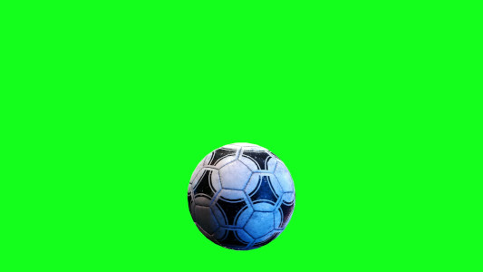

Praktikum 5: Applying erotion and dilation on binary image
===
How to build
---
```bash
mkdir build && cd build
cmake ../

make
```

Run the executable
---
```bash
./praktikum5
```

Input
---
### Soccer Ball


Result
---
### Masking Result
<div style="display: flex;">
  <div style="flex: 50%; padding: 5px;">
    
  </div>
  <div style="flex: 50%; padding: 5px;">
    
  </div>
</div>

### Erotion Result
<div style="display: flex;">
  <div style="flex: 50%; padding: 5px;">
    
  </div>
  <div style="flex: 50%; padding: 5px;">
    
  </div>
</div>

### Dilation Result
<div style="display: flex;">
  <div style="flex: 50%; padding: 5px;">
    
  </div>
  <div style="flex: 50%; padding: 5px;">
    
  </div>
</div>


### Dilation + Erotion
<div style="display: flex;">
  <div style="flex: 50%; padding: 5px;">
    
  </div>
  <div style="flex: 50%; padding: 5px;">
    
  </div>
</div>